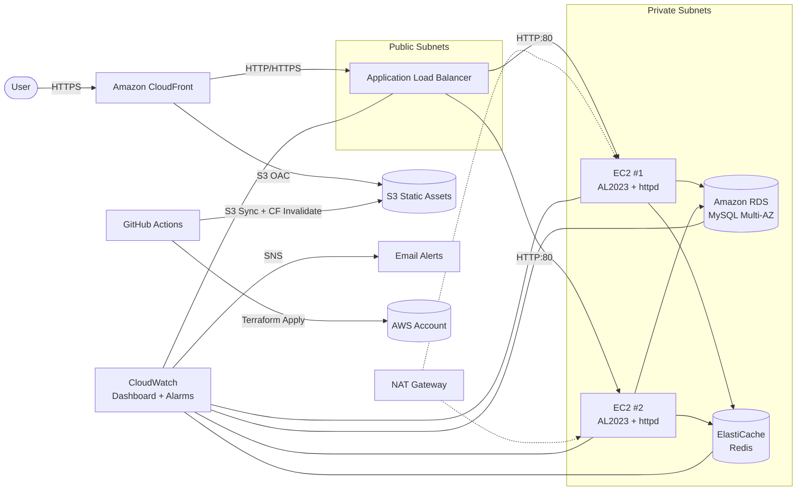

# Architecture Diagram

This diagram is renderable in GitHub, GitLab, VS Code, and most modern Markdown viewers.



## ASCII fallback

```
                      [User]
                         |
                         v
                  [CloudFront] <---> [S3 Static Assets]
                         |
                         v
                  [Application Load Balancer]
                  /                \
                 /                  \
        [EC2 Web 1]            [EC2 Web 2]      <-- Public Subnets
            \                      /
             \                    /
              +--------+---------+
                       |
                       v
        +-----------------------+        +-------------------+
        |  ElastiCache (Redis)  |        |   RDS (Multi-AZ)  |
        +-----------------------+        +-------------------+
                  (Private Subnets)

        [CloudWatch] -- metrics & logs ---> [SNS -> Email]
        [GitHub Actions] -- Terraform plan/apply --> [AWS]
```
